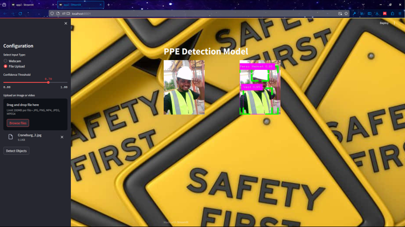

# PPE Detection using Streamlit


[](https://github.com/Danielowo2000/PPE-Detection-model/stargazers)
[](https://github.com/Danielowo2000/PPE-Detection-model/issues)

A real-time Personal Protective Equipment (PPE) detection application built with Streamlit and YOLOv8.



## Table of Contents

- [About](#about)
- [Features](#features)
- [Getting Started](#getting-started)
  - [Prerequisites](#prerequisites)
  - [Installation](#installation)
- [Usage](#usage)
- [Contributing](#contributing)
- [License](#license)

## About

This project is designed to detect and highlight individuals wearing or not wearing specific PPE items, such as helmets, gloves, vests, etc. It utilizes the YOLOv8 model for object detection and is powered by Streamlit for the user interface. The application supports both webcam input and file upload for image and video analysis.

## Features

- Real-time PPE detection
- Web interface powered by Streamlit
- Supports webcam and file upload as input sources
- Adjustable confidence threshold
- Stop the webcam when not in use

## Getting Started

Follow these instructions to get a copy of the project up and running on your local machine.

### Prerequisites

- Python 3.9+
- pip (Python package manager)

### Installation

1. Clone the repository:

   ```sh
   git clone https://github.com/Danielowo2000/PPE-Detection-model.git
